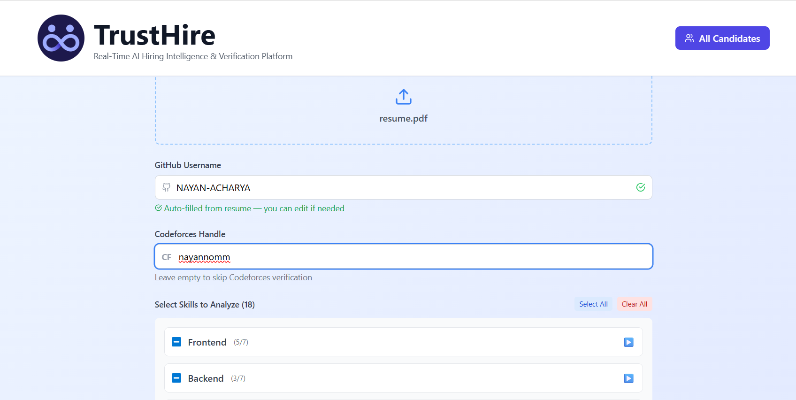
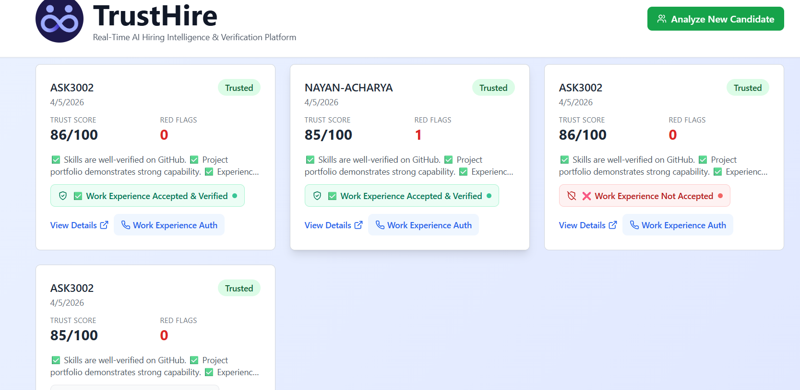

# 🧠 TrustHire – Real-Time AI Hiring Intelligence Platform

A full-stack web application that verifies whether candidates are genuinely skilled by analyzing their resume and comparing it against real-world signals.

## 🎯 Core Features

- **AI-Powered Resume Analysis** using Gemini API.
- **GitHub Profile Integration** to verify real-world skills, track contributions, and perform automated code reviews.
- **Codeforces Verification** to validate claimed competitive programming ranks.
- **Email Verification Service** for automated work experience and background authorization checks.
- **Multi-dimensional TrustScore Engine** evaluating skills, timeline, and employment history.
- **Real-Time Data Sync** powered by SpacetimeDB and MongoDB.

## 📸 Platform Previews

### TrustHire Verification Interface
Parses resumes seamlessly while validating candidate skills using integrations like GitHub and Codeforces.


### Candidates Dashboard
Monitors candidates with their composite TrustScore, Red Flags, and the interactive Work Experience Authorization status.


## 🚀 Quick Start (5 Minutes)

**Prerequisites:** Node.js 16+, GitHub Token, Gemini API Key.

1. **Install Dependencies:**
   ```bash
   cd client && npm install
   cd ../server && npm install
   ```
2. **Setup Environments:**
   Copy `.env.example` to `.env` in both `client` and `server` folders and fill in your keys (e.g. Gemini, GitHub).
3. **Run Dev Servers:**
   ```bash
   # Terminal 1 - Backend (Runs on port 5000)
   cd server && npm run dev
   
   # Terminal 2 - Frontend (Runs on port 5173)
   cd client && npm run dev
   ```

## 🛠️ Verification Integrations

Our platform utilizes multi-layered verification to ensure candidate authenticity:

1. **Email-Based Work Experience Authorization**
   - Automatically issues magic email links to previous employers to verify claimed work experience.
   - Logs approval, rejection, and verification statuses for dashboard review.
   - Ensures deep background checks simply and seamlessly.

2. **Codeforces Validation**
   - Automatically queries Codeforces API to fetch accurate user rankings and ratings.
   - Compares the official rank against the candidate's reported rank on the resume to catch exaggerators.

3. **Intelligent GitHub Verification**
   - Correlates claimed technical skills with actual GitHub repositories.
   - Optionally runs a random AI code-review to gauge coding standard.
   - Analyzes contribution activity to enforce timeline consistency.

## 📚 Full Documentation

For deeper details regarding the underlying application, please refer to:

- 🏗️ **[Architecture Guide](./ARCHITECTURE.md)**: System design, diagrams, flows, and database schemas.
- 📊 **[API Contract](./API.md)**: Comprehensive endpoint documentation for integrations.
- 📦 **[Project Summary](./PROJECT_SUMMARY.md)**: Extended delivery details and statuses.
- ⚙️ **[Setup Guide](./SETUP_GUIDE.md)**: Advanced installation and configuration steps.

---
**Built with ❤️ for honest hiring**